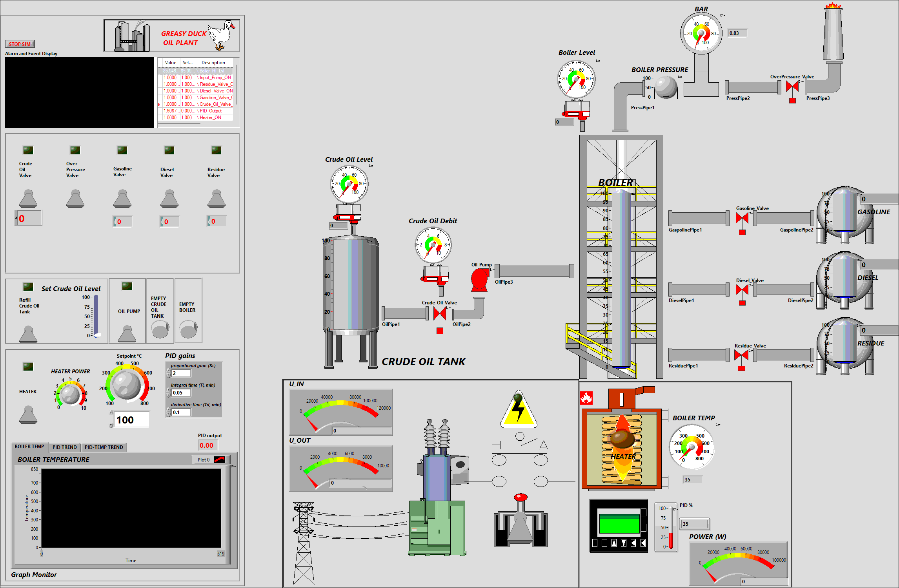
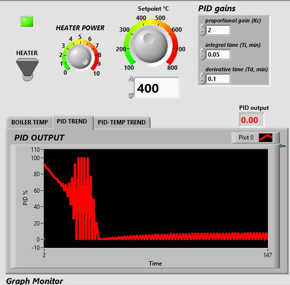

# LabVIEW Oil Refinery Simulator

Interactive simulation of an atmospheric crude oil distillation refinery built in **LabVIEW** with the **DSC Module**.

### Features
- Crude oil storage tank with level control
- Boiler with heater, pressure, and temperature dynamics
- Pump and valves for inlet/outlet flow
- Fraction production: gasoline, diesel, residue (temperature-dependent)
- Realistic pressure calculation (temperature + level + outlet valves + safety valve)
- PID control for boiler temperature stabilization
- Electrical chain: 110 kV line → HV switch → transformer → 6 kV → heater
- DSC alarms (HI/HI_HI/LO/LO_LO + Rate of Change)
- Historical & real-time trends + alarm & event display
- Logging to Citadel database

### Screenshots

#### Main HMI

#### PID & Temperature Stabilization
| PID Stabilization (Output vs Temperature) | Temperature Stabilization (Setpoint Tracking) |
|-------------------------------------------|-----------------------------------------------|
|  |  |
